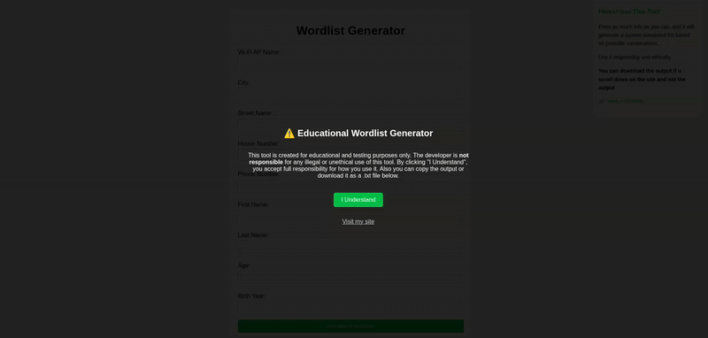

# WordSmith

WordSmith is a user-friendly **wordlist generator** designed specifically for **educational and penetration testing purposes**. This tool helps you generate a custom list of possible passwords based on personal information. Perfect for ethical hackers, security researchers, and anyone interested in learning about password security.

---

## 🚀 How to Use the Tool

1. Visit the WordSmith website.
2. Enter as much information as possible about the target or system, such as:
   - Wi-Fi AP Name
   - City
   - Street Name
   - House Number
   - Phone Number
   - First Name
   - Last Name
   - Age
   - Birth Year
3. Click the **Generate Passwords** button to create a list of possible passwords based on combinations of the entered data.
4. View the generated passwords directly on the page.

---

## 💾 Downloading the Output

You can easily **download the generated passwords as a .txt file** by clicking the **Download as .txt** link below the password list. This makes it convenient to save your wordlist or use it with tools like `hashcat` or `John the Ripper`.
<strong>Just give it the info you want in it (i did random info for this gif) In the gif it shows how to download it as a .txt</strong>

---

## ⚠️ Disclaimer

This tool is intended for **educational and authorized penetration testing use only**. Misuse of this tool for unauthorized or illegal activities is strictly prohibited. The developer is not responsible for any damages or consequences arising from improper use.

Always use WordSmith ethically and with proper permission.

---

Thank you for using WordSmith! If you have suggestions or want to contribute, feel free to open an issue or submit a pull request.
